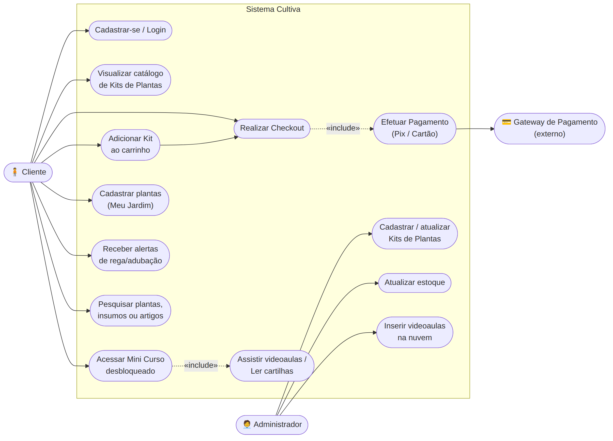
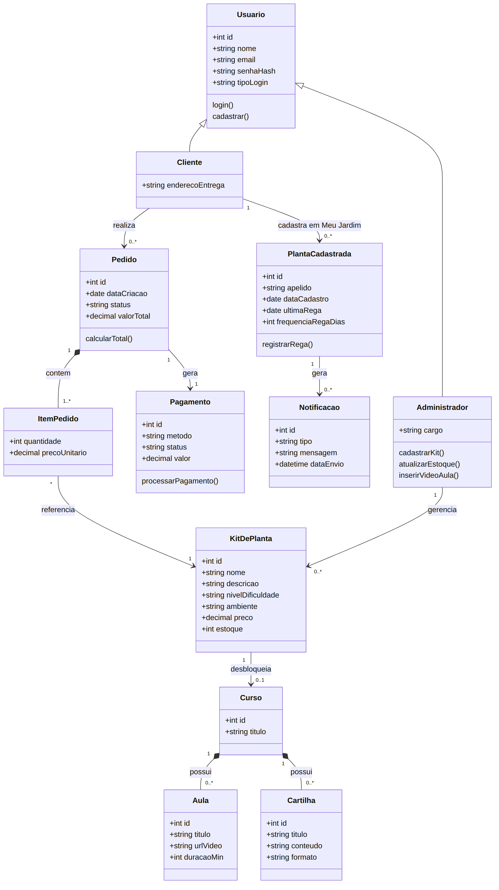
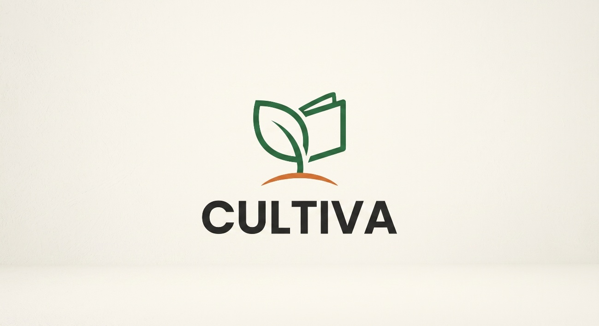

# 🌿 Cultiva

O **Cultiva** é um ecossistema que transforma qualquer pessoa em um "dedo verde". A plataforma une e-commerce especializado (kits de jardinagem prontos) com aprendizado contínuo (guias e videoaulas), resolvendo a alta taxa de mortalidade de plantas domésticas causada pela falta de instrução e insumos corretos.

> "Toda grande empresa começou com um PowerPoint mal feito e muita cara de pau." — provavelmente um fundador de startup

## 🚀 O Problema

O mercado atual vende plantas sem instrução, ou vende cursos sem os insumos certos. O usuário comum sofre com a jornada fragmentada: compra a planta em um lugar, pesquisa cuidados em fóruns genéricos e busca terra/adubo em outra loja. O Cultiva centraliza essa jornada completa em um único app.

**Público-alvo:** jovens adultos e adultos (20–45 anos) de centros urbanos, moradores de apartamentos, que quer bem-estar e conexão com a natureza mas têm rotina agitada e pouca experiência prática com botânica.

## 💡 Diferencial e Pitch

- **Solução end-to-end:** identifica a necessidade, entrega o kit certo e ensina a cuidar passo a passo.
- **Combate à "síndrome do dedo podre":** kits divididos por nível de experiência e ambiente (pouca luz, apartamento, pet friendly).
- **Kits temáticos curados:** planta + vaso + substrato + adubo + ferramenta, em uma venda casada inteligente.

O pitch completo (modelo "1 minuto Shark Tank") está em [`docs/checkpoint-04-idealizacao/5.Ideia-de-venda-pitch.docx`](docs/checkpoint-04-idealizacao/5.Ideia-de-venda-pitch.docx).

## 📋 Requisitos do Sistema

Documentação completa (problema, persona, requisitos funcionais RF01–RF08, requisitos não funcionais RNF01–RNF05 e escopo do MVP) em [`docs/checkpoint-04-idealizacao/1.Documentacao-inicial.docx`](docs/checkpoint-04-idealizacao/1.Documentacao-inicial.docx).

## 🧩 Modelagem (UML)

**Diagrama de Casos de Uso**



**Diagrama de Classes**



Fontes editáveis (Mermaid) em `docs/uml/*.mmd`. Explicação detalhada dos diagramas em [`docs/checkpoint-04-idealizacao/3.Modelagem UML.docx`](<docs/checkpoint-04-idealizacao/3.Modelagem UML.docx>).

## 🎨 Identidade Visual



- **Paleta:** Verde Botânico `#2E6F40` · Terracota `#D97736` · Amarelo Sol `#F4C430` · Creme Suave `#FAF6F0` · Grafite `#222222`
- **Tipografia:** títulos em Poppins/Montserrat, corpo em Inter/Roboto.
- Mockup da home em [`assets/marca/home-mockup.jpeg`](assets/marca/home-mockup.jpeg). Detalhes completos em [`docs/checkpoint-04-idealizacao/4.Desenvolvimento-de-marca.docx`](docs/checkpoint-04-idealizacao/4.Desenvolvimento-de-marca.docx).

## 🛠️ Tecnologias Previstas

- **Frontend:** (a definir — app mobile, Android/iOS)
- **Backend:** (a definir)
- **Nuvem/Infra:** AWS
- **Pagamentos:** gateway terceirizado (Mercado Pago / Stripe) para Pix e cartão de crédito

## 📁 Estrutura do Repositório

```
Projeto-Cultiva/
├── README.md
├── docs/
│   ├── checkpoint-04-idealizacao/   # entregáveis do Checkpoint 4 (docs, pitch, marca, UML)
│   └── uml/                         # diagramas UML (imagens + fontes .mmd)
├── assets/
│   └── marca/                       # logo e mockups da identidade visual
├── src/                             # código-fonte (a partir do próximo checkpoint)
├── backend/                         # API / banco de dados (a definir)
└── frontend/                        # aplicativo mobile (a definir)
```

## 👥 Equipe (FIAP - Engenharia de Software)

- Gabriel Lacerda Covello Arimatéa - RM556391
- Geovana Carvalho Pederneschi - RM559092
- Gustavo Andrade de Sousa - RM559069
- Lucas Santos Rodrigues - RM556891
- Mayene Gabrielle Aragão Padilha Dória - RM558858
- Thais Helena Ferreira Vieira - RM552387

Professor: Hercules Lima Ramos
